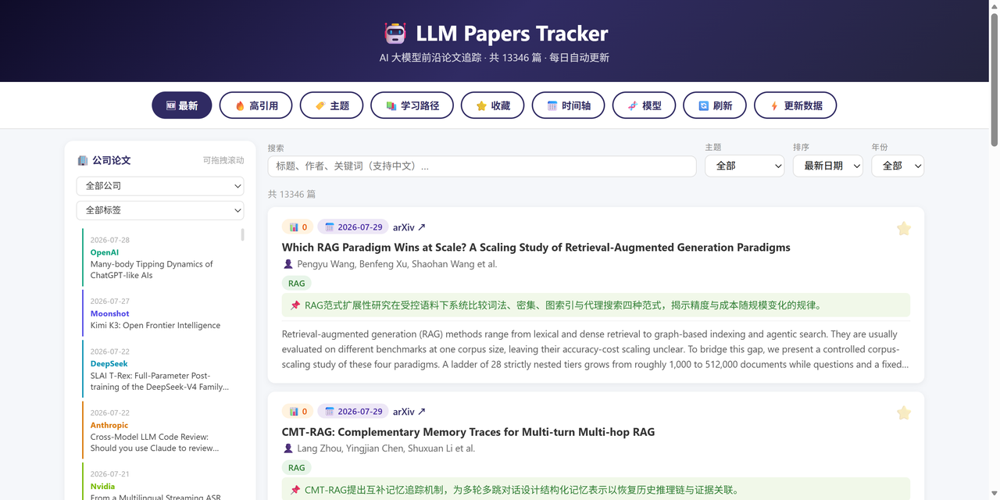
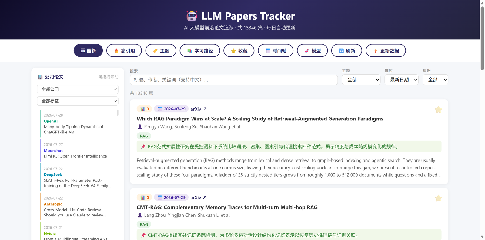
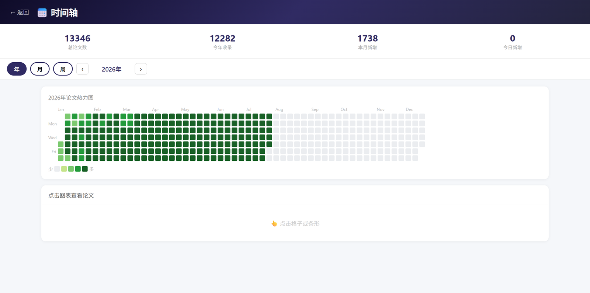
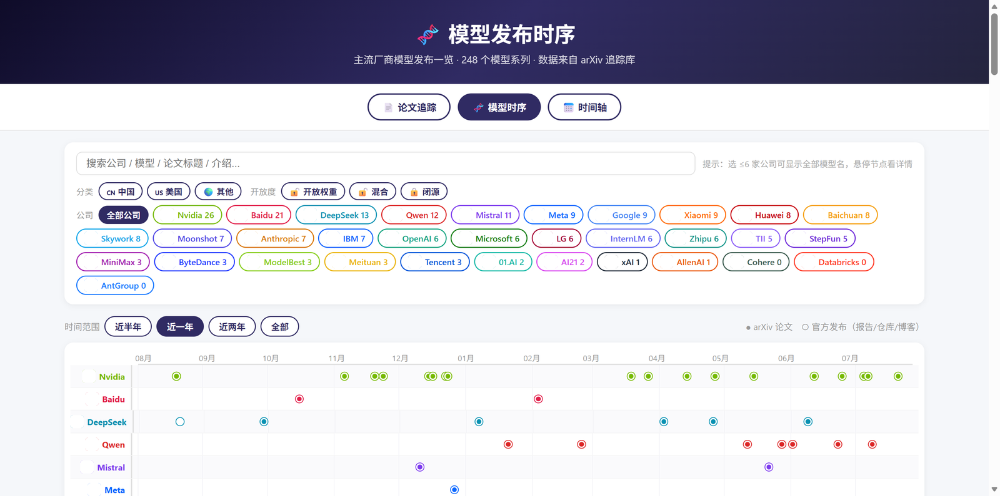

<div align="center">

# 🤖 LLM Papers Tracker

**每日自动追踪 arXiv 大模型前沿论文 · 公司专栏 · 模型发布时序 · 学习路径**

**A self-updating tracker of cutting-edge LLM research — papers, company watch, model timeline & learning path**

[](https://github.com/Xplore-LAB/llm-tracker/actions/workflows/update-papers.yml)
[](https://xplore-lab.github.io/llm-tracker/)
[](LICENSE)
[](https://xplore-lab.github.io/llm-tracker/)
[](https://github.com/Xplore-LAB/llm-tracker/stargazers)

### [🌐 Live Demo 在线访问](https://xplore-lab.github.io/llm-tracker/) · [📅 时间轴](https://xplore-lab.github.io/llm-tracker/timeline/) · [🧬 模型时序](https://xplore-lab.github.io/llm-tracker/models/)

[English](#-english) · [中文](#-中文)



</div>

---

## 🇨🇳 中文

零后端、零成本的 LLM 前沿情报站:纯静态页面 + GitHub Actions 每日自动抓取 arXiv,数据即 JSON,克隆即可用。

### ✨ 功能一览

- **📰 论文追踪** — 13,000+ 篇 LLM 相关论文,每日 UTC 01:00 自动更新;支持搜索(中英)、主题筛选、年份筛选、引用量/日期排序、收藏(localStorage)
- **🏢 公司专栏** — 追踪 34 家 AI 公司(OpenAI、Google、Meta、Anthropic、DeepSeek、Qwen、Moonshot、xAI……)的官方论文,经作者单位校验,侧栏时间轴可拖拽浏览
- **🇨🇳 中文笔记** — 每日新论文自动生成中文标题与一句话笔记(LLM 驱动,可选)
- **🏷️ 八大主题** — RAG / Agent / MCP / Reasoning / Multimodal / Fine-tuning / Safety / LLM 自动分类
- **📅 论文热力图** — GitHub 风格年度热力图 + 月/周视图,点击格子直达当日论文
- **🧬 模型发布时序** — 248 个模型系列,按公司/地区/开放度筛选,悬停查看架构图与仓库链接
- **📚 学习路径** — 从 Transformer 到 RLHF 的分阶段经典论文精读路线
- **📄 PDF 直链** — 公司重点论文 PDF 自动归档,站内一键直达

### 📸 截图

| 论文追踪 | 时间轴热力图 | 模型发布时序 |
|:---:|:---:|:---:|
|  |  |  |

### 🚀 Fork 部署你自己的 Tracker

1. **Fork** 本仓库
2. **开启 Pages**:Settings → Pages → Source 选 `Deploy from a branch` → `master` / `(root)`,稍等片刻即可通过 `https://<你的用户名>.github.io/llm-tracker/` 访问
3. **(可选)启用中文笔记生成**:Settings → Secrets and variables → Actions
   - Secret `LLM_API_KEY`:任意 OpenAI 兼容 API 的 key
   - Variable `LLM_BASE_URL`(默认 `https://api.moonshot.cn/v1`)、`LLM_MODEL`(默认 `moonshot-v1-8k`)
4. **每日自动更新**:GitHub Actions 每天 UTC 01:00 自动抓取;也可在 Actions 页手动触发,或点站点上的「⚡ 更新数据」按钮

### 🗂 仓库结构

```
├── index.html            # 论文追踪主页(纯静态,无构建)
├── timeline/             # 论文热力图页
├── models/               # 模型发布时序页(+ 架构图 img/)
├── papers.json           # 论文主数据(累积)
├── company-papers.json   # 公司论文索引
├── timeline-data.json    # 热力图数据
├── models.json           # 模型发布数据
├── learning-path.json    # 学习路径
├── scripts/              # 数据抓取与处理(Python)
│   ├── fetch_papers.py       # 每日主任务:arXiv 抓取、打标、中文笔记
│   ├── download_pdfs.py      # 公司论文 PDF 归档
│   ├── extract_models.py     # 模型发布信息抽取
│   ├── extract_figures.py    # 架构图抽取(PyMuPDF)
│   ├── fetch_by_ids.py       # 按 arXiv ID 补录
│   └── backfill_history.py   # 历史回填
└── .github/workflows/    # 每日自动更新 + PDF 归档分支发布
```

### 📄 数据 Schema(papers.json)

| 字段 | 说明 |
|---|---|
| `id` | arXiv ID |
| `title` / `title_zh` | 英文标题 / 中文标题 |
| `authors` | 作者(前几位) |
| `abstract` | 摘要 |
| `date` / `year` | 发布日期 / 年份 |
| `cite` | 引用量 |
| `tags` | 主题标签(RAG、Agent、MCP…) |
| `note` | 中文一句话笔记 |
| `company` | 归属公司(公司论文才有) |

### 🤝 参与贡献

发现数据错误、想推荐论文或新功能?请阅读 [CONTRIBUTING.md](CONTRIBUTING.md),或直接开 Issue。

---

## 🇬🇧 English

A zero-backend, zero-cost intelligence hub for LLM research: fully static pages + GitHub Actions crawling arXiv daily. Data is plain JSON — clone and use.

### ✨ Features

- **📰 Paper tracking** — 13,000+ LLM papers, auto-updated daily at 01:00 UTC; bilingual search, topic/year filters, citation & date sorting, local favorites
- **🏢 Company watch** — verified papers from 34 AI labs (OpenAI, Google, Meta, Anthropic, DeepSeek, Qwen, Moonshot, xAI…) in a draggable sidebar timeline
- **🇨🇳 Chinese notes** — daily one-line Chinese summaries for new papers (LLM-powered, optional)
- **🏷️ 8 topics** — RAG / Agent / MCP / Reasoning / Multimodal / Fine-tuning / Safety / LLM, auto-classified
- **📅 Heatmap** — GitHub-style yearly heatmap with month/week views; click a cell to read that day's papers
- **🧬 Model timeline** — 248 model families filterable by company/region/openness, with architecture figures & repo links
- **📚 Learning path** — staged reading list of classics from Transformer to RLHF
- **📄 PDF archive** — key company papers archived with direct in-site links

### 🚀 Self-host in 2 minutes

1. **Fork** this repo
2. **Enable Pages**: Settings → Pages → `Deploy from a branch` → `master` / `(root)`
3. *(Optional)* Add secret `LLM_API_KEY` (any OpenAI-compatible API) for Chinese note generation; variables `LLM_BASE_URL` / `LLM_MODEL` to override defaults
4. GitHub Actions refreshes data daily at 01:00 UTC, or trigger manually from the Actions tab / the site's "⚡" button

### 📄 License

Code is [MIT](LICENSE). Paper metadata comes from [arXiv](https://arxiv.org/) — please respect its terms of use.

---

## 📈 Star History

[](https://star-history.com/#Xplore-LAB/llm-tracker&Date)

<div align="center">

**如果这个项目对你有帮助,欢迎 ⭐ Star 支持! / If this helps you, a ⭐ means a lot!**

</div>
